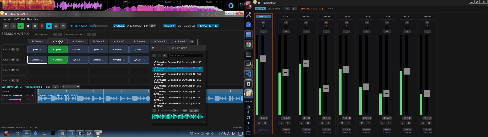

# Hikaru OpenStudio

> DAW modular, libre y multiplataforma escrito en Rust. Tiempo real, baja latencia y UI inmediata.

[](https://www.gnu.org/licenses/agpl-3.0)
[](https://www.rust-lang.org)
[](#instalación)
[](https://github.com/emilk/egui)
[](https://github.com/RustAudio/cpal)

**Hikaru OpenStudio** es una estación de trabajo de audio digital (DAW) de código abierto y multiplataforma (Linux, Windows y FreeBSD) escrita en Rust enfocado en:

- **Rendimiento en tiempo real** sin allocations ni bloqueos en el hilo de audio.
- **UI inmediata con `egui`** — Session View por escenas, Mixer Rack flotante y editor de clips.
- **Motor de audio con CPAL** + secuenciador sample-accurate con compensación de latencia.

---

## Vista Previa



*Session Matrix disparando escenas, File Explorer integrado con preview de samples, Clip Track Editor y Mixer Rack con vúmetros en tiempo real.*

---

## Características Principal

- **Session Matrix / OpenLive:** Grilla de clips con lanzamiento cuantizado y triggers por escena.
- **Mixer:** Canales independientes + Master, faders, mute/solo/arm y vúmetros Peak/RMS.
- **Transporte global:** Play/stop/record, BPM, metrónomo y loop con Time Selection.
- **Secuenciador (`hikaru_sequencer`):** Scheduler sample-accurate, lookahead y prioridad rítmica en el hilo de audio.
- **DSP Rack (`hikaru_dsp`):** Filtros, flanger, phaser, ultracomb, open-harmonic y sintesis wavetable nativa.
- **Host de plugins (`hikaru_plugin_host`):** Soporte VST3 y CLAP.

---

## Compilación Rápida (Linux / Debian / Ubuntu)

```bash
# 1. Instalar dependencias base
sudo apt update && sudo apt install -y build-essential pkg-config git libasound2-dev libx11-dev libgl1-mesa-dev

# 2. Clonar y ejecutar
git clone [https://github.com/hikarucorporation/hikaru-openstudio.git](https://github.com/hikarucorporation/hikaru-openstudio.git)
cd hikaru-openstudio
cargo run --release -p hikaru_gui

```

---

## Licencia

Este programa es software libre bajo los términos de la **GNU Affero General Public License (AGPLv3)**. Ver [`LICENSE`](https://www.gnu.org/licenses/agpl-3.0.en.html) para más detalles.
